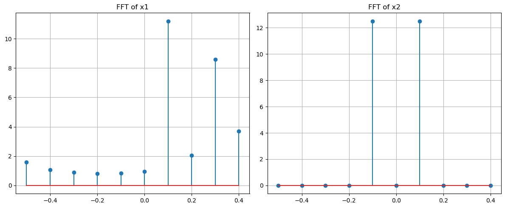
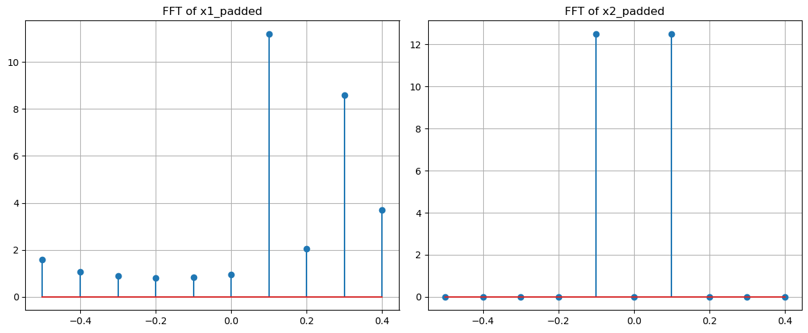
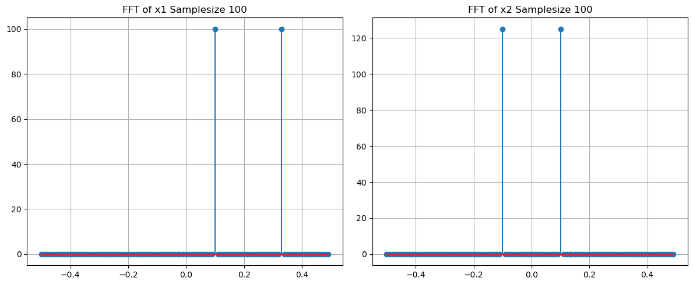
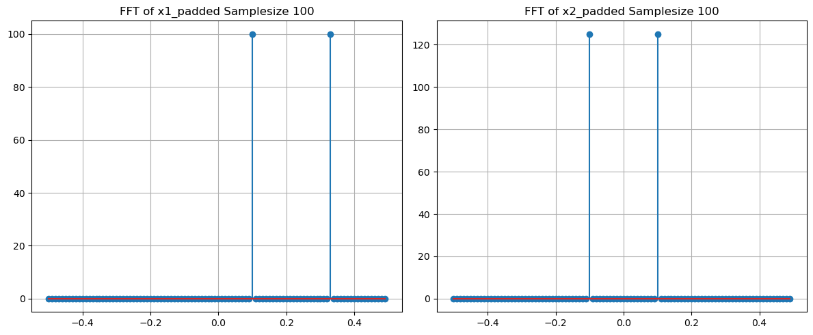
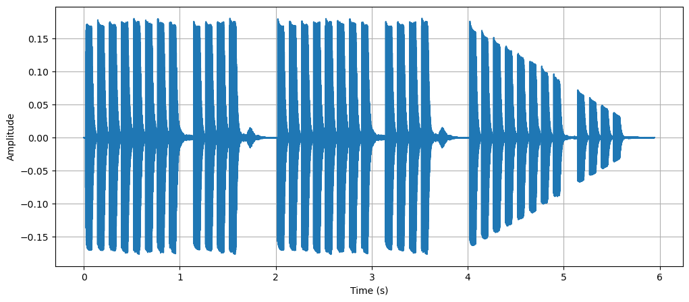
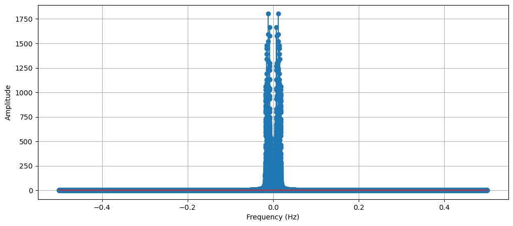
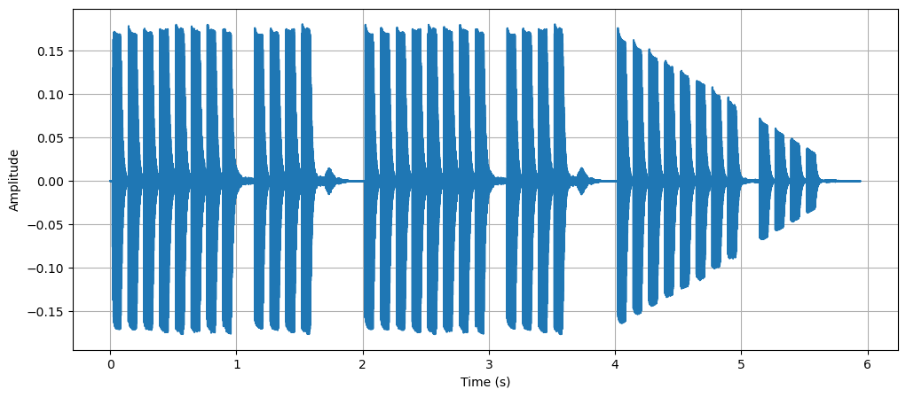
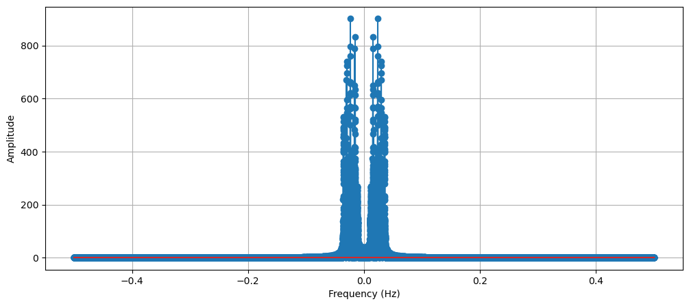
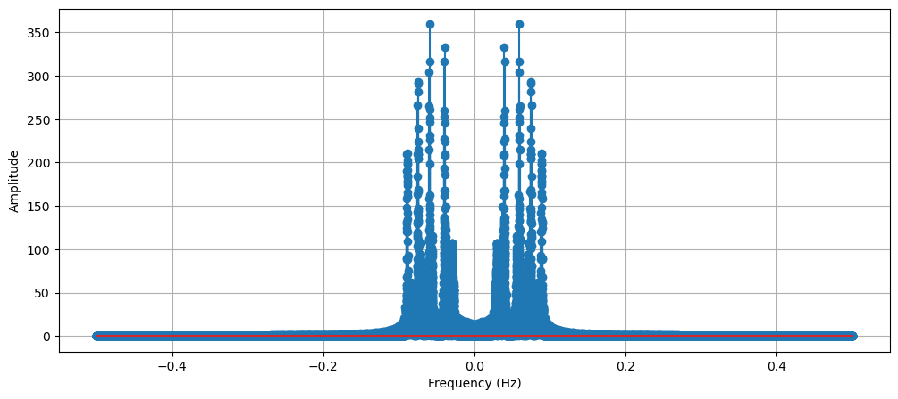

# A Discrete Fourier Transform and Zero Padding

## A.1 Length-N DFT Magnitude of signals x1[n] and x2[n]


```
Figure 1: Fourier Transform of x1[n] and x2[n]
```
```
X 1 (jw) =ej^2 πn(10(1))/^100 +ej^2 πn^33 /^100 (1)
```
X 2 (jw) = 2cos(2πn(10(1))/100) + 0. 5 cos(2πn(10(9))/100) (2)
When analyzing the above spectrums, it appears that X2 has a synmmetrical signal
while X1 is not. This is due to the second function being based on the sum of two cos
functions, which are both real signals, while the first signal is of two complex exponential
terms. The complex exponential terms are not real, as shown in the magnitude spectra
not being symmetrical, while cos is symmetrical and real.
It is possible to distinguish frequency components in X2, as they occur at a specific
frequency. for X2, there should be an impulse at both positive and negative 1/10 and
9/10. On the other hand, the 2 impulses for X1 seem to have been spread apart.
This is due to ”spectral leakage” where the values leak to other frequencies since we
are not sampling the value at the complex exponential (sampling from (-0.5 : 0.5: 0.1)
but complex exp. exists at 3.3).


## A.2 Zero-Padding the Signals with 490 Zeros


```
Figure 2: Fourier Transform of x1[n] and x2[n] with 490 zero padding 
```
Even after padding, the signals’ spectras have not seemed to change.

## A.3 DFT of x1[n] and x2[n] with samplesize 100


```
Figure 3: Fourier Transform of x1[n] and x2[n] with sample size 100
```
By increasing the sample size, the spectra for x1[n] has resulted in only 2 impulses located
at the frequencies 1/10 and 3.3/10 as expected.


## A.4 Zero-padding of 400 zeros with samplesize 100


Figure 4: Fourier Transform of x1[n] and x2[n] with sample size 100 and 400 zero padding

Similar to before, there are no improvements to the spectra after adding padding to it
(improving resolution)

# B Sampling

## B.1 N0, T0, and T for Y

In order to get theN 0 , just taking the length of y (len(y)) will provide us the number of
samples. for the Duration of the signalT 0 , Take the number of samples (N 0 ) and divide
by fs. Similarly, to get the Sampling Period T, just take the reciprocal of the Sampling
Frequency fs.

```
N 0 =len(y) = 262094
```
```
T 0 =
```
### N 0

```
fs
```
```
= 5. 94 secs
```
### T=

### 1

```
fs
```
```
= 2. 26 ∗ 10 − 5 secs
```

## B.2 Plot of signal y with respect to time


```
Figure 5: Signal y with respect to Time
```
## B.3 DFT of signal Y


```
Figure 6: DFT of Signal y
```
## B.4 N0, T0, and T for Y

In order to get theN 0 , just taking the length of y (len(y)) will provide us the number of
samples. for the Duration of the signalT 0 , Take the number of samples (N 0 ) and divide
by fs. Similarly, to get the Sampling Period T, just take the reciprocal of the Sampling
Frequency fs.

```
N 0 =len(y1) = 131047
```
```
T 0 =
```
### N 0

```
fs
```
```
= 5. 94 secs
```
### T=

### 1

```
fs/ 2
```
```
= 4. 54 ∗ 10 − 5 secs
```

## B.5 Plot of signal y1 with respect to time


```
Figure 7: Signal y1 with respect to Time
```
## B.6 DFT of signal Y


```
Figure 8: DFT of Signal y
```
When looking at the two graphs, they don’t appear to look very different until zooming
in. What can be found is that the DFT of the signal Y1 has half as many impulses as
compared to Y2. This is because by taking subsamples at a rate of 2, we are taking
half as much samples, and resulting in a lower resolution of our sound without losing too
much important details.

## B.7 Comparing audio

When comparing both audios, they sound very similar and have very minimal differences.


## B.8 Sub sampling at a rate of ’5’


```
Figure 9: Signal y2 with respect to Time
```

```
Figure 10: DFT of Signal y
```
Although it is again very hard to tell the difference in the signal y2 with respect to time,
the magnitude spectra again shows a decrease in impulses of the system. This results in
lower audio quality as it is missing more frequencies that are part of the audio.
The audio is also much faster and comes off very high-pitched.

# C Filter Design


